# Node Directory

Unity has a lot of different components and scripting nodes available. Finding the ones you need can prove very difficult, especially since there is very little documentation. 
The official [Node reference](https://docs.unity3d.com/Packages/com.unity.visualscripting@1.9/manual/vs-nodes-reference.html) page lists a handful of important nodes, 
but there are more we will be using (and many more than that besides). This page is intended as a reference to the subset of important nodes you will need for COMP1151.
The list is broken down by component.

Some of these nodes are labelled as 'Custom'. These have been written by the teaching staff as extensions to Unity to provide useful features. These will be included in
your prac or assignment framework code for you to use. You are also welcome to use these in your own projects, without restriction.

## Contents

* [Event Nodes](#event-nodes)
   * [On Start](#on-start)
   * [On Update](#on-update)
   * [On Enable](#on-enable)
   * [On Destroy](#on-destroy)
* [Trigger Events](#trigger-events)
   * [On Trigger Enter 2D](#on-trigger-enter-2d)
   * [On Trigger Exit 2D](#on-trigger-exit-2d)
   * [On Trigger Stay 2D](#on-trigger-stay-2d)
* [Collision Events](#collision-events)
   * [On Collision Enter 2D](#on-collision-enter-2d)
   * [On Collision Exit 2D](#on-collision-exit-2d)
   * [On Collision Stay 2D](#on-collision-stay-2d)
* [Variable Nodes](#variable-nodes)
   * [Get Variable](#get-variable)
   * [Set Variable](#set-variable)
* [Control Nodes](#control-nodes)
   * [If](#if)
   * [Select](#select)
   * [For Loop](#for-loop)
* [Object Nodes](#object-nodes)
   * [Set Active](#set-active)
   * [Destroy](#destroy)
   * [Instantiate](#instantiate)
   * [Find](#find)
   * [Find With Tag](#find-with-tag)
* [Input Nodes](#input-nodes)
   * [On Input System Event Button](#on-input-system-event-button)
   * [On Input System Event Float](#on-input-system-event-float)
   * [On Input System Event Vector 2](#on-input-system-event-vector-2)
* [Formula Nodes](#formula-nodes)
   * [Add](#add)
   * [Subtract](#subtract)
   * [Multiply](#multiply)
   * [Divide](#divide)
   * [Formula](#formula)
* [Transform](#transform)
   * [Get Position](#get-position)
   * [Get Rotation](#get-rotation)
   * [Get Local Scale](#get-local-scale)
   * [Set Position](#set-position)
   * [Set Local Scale](#set-local-scale)
* [Time](#time)
   * [Get Delta Time](#get-delta-time)
   * [Per Second](#per-second)
* [Vector2](#vector2)
   * [Get Magnitude](#get-magnitude)
   * [Get Normalized](#get-normalized)
* [Debug](#debug)
   * [Log](#log)
* [Custom Nodes](#custom-nodes)
   * [Translate Rigidbody 2D](#translate-rigidbody-2d)
   * [Rotate Rigidbody 2D](#rotate-rigidbody-2d)
   * [Rotate Transform 2D](#rotate-transform-2d)
   * [Is On Layer](#is-on-layer)

---
## Event Nodes
You can think of lifecycle events as starting points within your scripts. They will each trigger under different conditions and execute all connected nodes.

Read more about events [here](https://docs.unity3d.com/Packages/com.unity.visualscripting@1.9/manual/vs-events-reference.html).

### On Start ##
This event triggers exactly once when the script is first enabled, before the On Update event. Usually, this will occur as soon as you start your game, but it can also trigger if you enable an object for the first time (using something like Set Active). Note this can only occur once, so if you disable the object and re-enable it again, it won’t trigger again. This is often used to initialise settings or values in an object.

Inputs: 
- None

Outputs: 
- Trigger (Flow): The next node to execute.

Usage Example:
- These nodes use Start to retrieve and store the player avatar’s starting position after the game starts. The reason we might want to do this is because we may be uncertain about the player avatar’s position, when the game starts as it can be moved in the editor before starting the game.

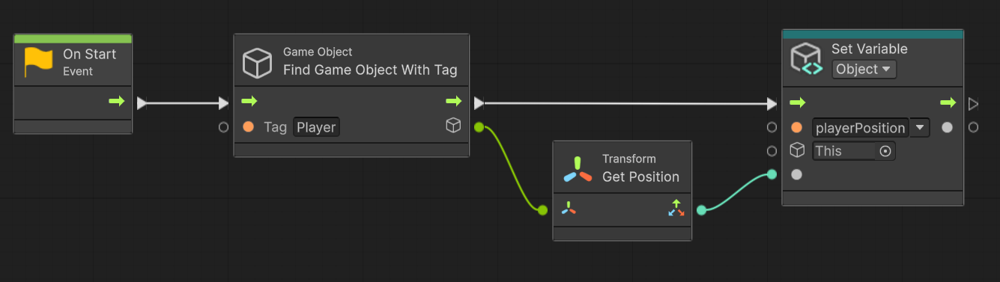

### On Update ##
This event triggers once every frame while the script is enabled. This is useful for any continuous or repeating things and will likely be the lifecycle event you use the most. This can be influenced by framerate, so if something is framerate-sensitive, use FixedUpdate instead.

Inputs: 
- None

Outputs: 
- Trigger (Flow): The next node to execute.

Usage Example: 
- Update is ideal for doing things that aren’t reliant on framerate, like modifying variables or watching for specific conditions. In this example, we control the player avatar’s colour based on whether they have a power-up or not.

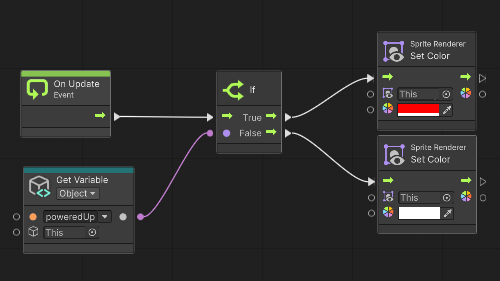

### On Fixed Update ##
This event is similar to the Update event, but instead, it executes at a fixed time interval that is unaffected by framerate. By default, it executes every 0.02 seconds. This is generally used for physics calculations, as they should not be influenced by framerate.

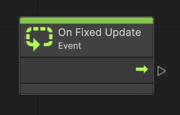

Inputs:
- None

Outputs:
- Trigger (Flow): The next node to execute.

Usage Example:
- This example is a standard implementation of 2D movement. Physics calculations and movement are being performed via FixedUpdate.

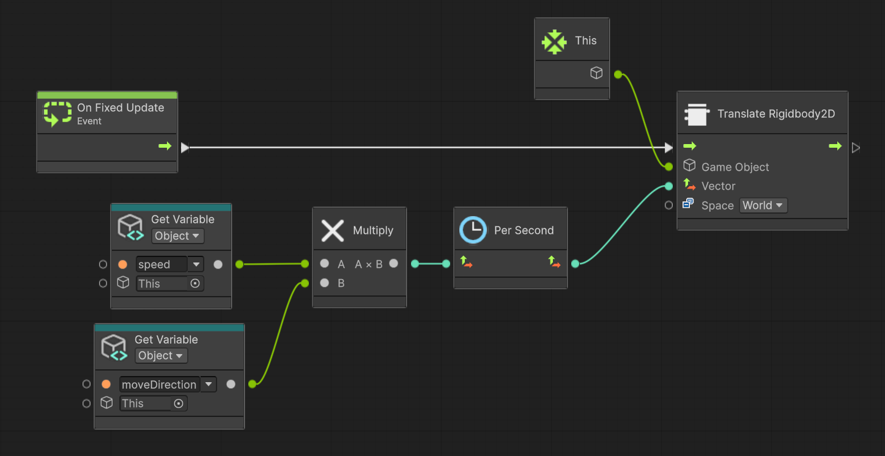

### On Enable ##
This event is similar to the Start event, but instead, it executes every time the GameObject the script is attached to is enabled (you can see if an object is enabled by inspecting it and ), including at the start of the game. Like Start, this can be used to initialise settings or values, but can also be used to reset them whenever the object is re-enabled.

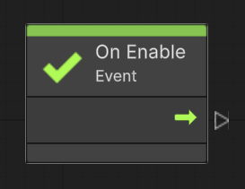

Inputs:
- None

Outputs:
- Trigger (Flow): 

Usage Example:
- This is an example of a respawning enemy. This script demonstrates the process the enemy goes through each time it respawns. Respawning may be handled by another script, like an enemy manager or spawner.

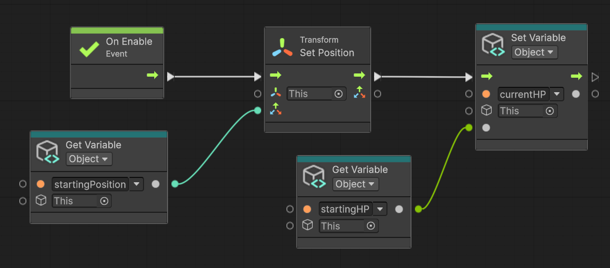

### On Destroy ##
This event executes before the attached GameObject or component is destroyed. There are a few ways something can be destroyed, but the most common are the Destroy node and loading a different scene.

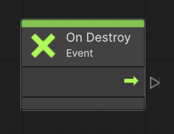

Inputs:
- None

Outputs:
- Trigger (Flow): 

Usage Example:
- In this example, we've written a script for a coin. When it is collected, it gets destroyed. We’re using the On Destroy event to add to the score. Note that there are many ways to achieve this same result, but this is just one.

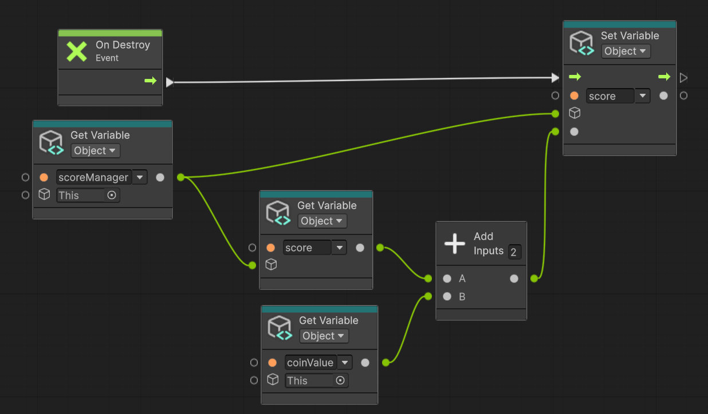

---
## Trigger Events
These events will occur whenever a collision between this object and another is detected. In this case, a collision can be defined as two colliders overlapping. There must be at least one trigger collider and one Rigidbody 2D involved. It doesn’t matter which object these components are attached to.

Depending on the types of colliders involved, a trigger event may not occur. Most notably with trigger colliders, two static trigger colliders (meaning they are not using Rigidbodies) cannot interact with one another.

Please note that there are 2D and 3D variants of these nodes. Make sure you are using the 2D ones.

Read more about collision [here](https://docs.unity3d.com/6000.3/Documentation/Manual/collision-section.html).

### On Trigger Enter 2D ##
This event occurs once each time a collision is detected. It can be triggered again with the same object if the colliders stop touching and collide again.

Inputs: 
- Target (GameObject): If a GameObject is passed into this, the node will only execute when a collision with the specified GameObject is detected.

Outputs: 
- Trigger (Flow): The next node to execute.
- Collider (Collider 2D): The collider component of the colliding object.

Usage Example:
- This example shows how a player avatar might respond to colliding with a damaging entity and taking damage. It checks if the colliding object is tagged as a damager, then subtracts health if it is.

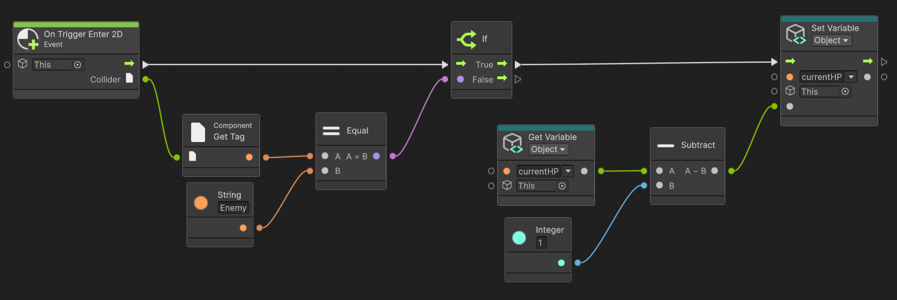

### On Trigger Exit 2D ##
This event occurs once after two colliders stop colliding (in that they stop touching). It can be triggered again with the same object if the objects collide again and stop touching.

Inputs: 
- Target (GameObject): If a GameObject is passed into this, the node will only execute when a collision with the specified GameObject is detected.

Outputs: 
- Trigger (Flow): The next node to execute.
- Collider (Collider 2D): The collider component of the colliding object.

Usage Example:
- In this example, we’re making a script to control a button-activated door. While the button is held down (i.e. something is colliding with it), the door opens, and when the button is released, the door closes.

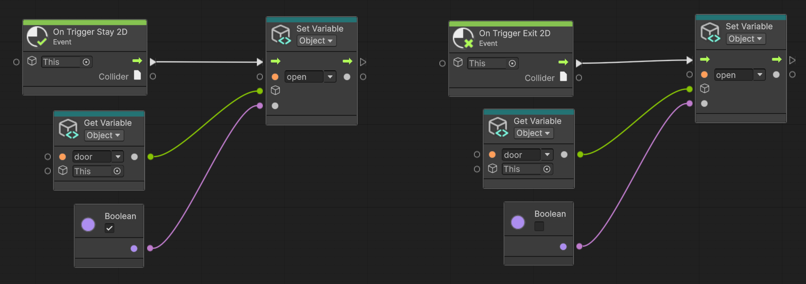

### On Trigger Stay 2D ##
This event occurs every physics timestep (by default, 50 times per second) while two colliders are touching.

The script may stop detecting collisions if the object stops moving. This is because the rigidbody thinks it’s at rest and is put to [sleep](https://docs.unity3d.com/6000.3/Documentation/ScriptReference/Rigidbody2D-sleepMode.html). To disable this, go to the object’s Rigidbody 2D component and set its Sleeping Mode to Never Sleep.

Inputs: 
- Target (GameObject): If a GameObject is passed into this, the node will only execute when a collision with the specified GameObject is detected.

Outputs: 
- Trigger (Flow): The next node to execute.
- Collider (Collider 2D): The collider component of the colliding object.

Usage Example:
- In this example, we’re going to make a heat zone, consisting of a large trigger collider. While inside the zone, they periodically take damage.

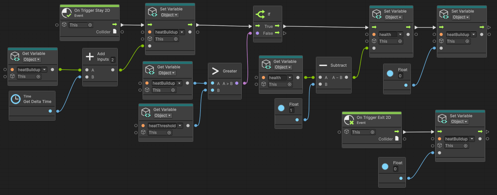

---
## Collision Events
These events will occur whenever a physical collision occurs between two non-trigger colliders. In this case, a collision can be defined as two colliders overlapping. One of the colliders must also be a dynamic collider, meaning it has a Rigidbody 2D component that is set to Dynamic mode.

The outputs of these nodes are quite extensive, containing all sorts of information about the collision that occurred. This is generally most useful for responding dynamically to collisions.

Please note that there are 2D and 3D variants of these nodes. Make sure you are using the 2D ones.

Read more about collisions [here](https://docs.unity3d.com/6000.3/Documentation/Manual/collision-section.html).

### On Collision Enter 2D ##
This event occurs once each time a collision is detected. It can be triggered again with the same object if the colliders stop touching and collide again.

Inputs: 
- Target (GameObject): If a GameObject is passed into this, the node will only execute when a collision with the specified GameObject is detected.

Outputs: 
- Trigger (Flow): The next node to execute.
- Collider (Collider 2D): The collider component of the colliding object.
- Contacts (Contact Point 2D Array): An array of [ContactPoint2D](https://docs.unity3d.com/6000.3/Documentation/ScriptReference/ContactPoint2D.html)s. These objects contain quite a bit of information, but most notably, they can tell you exactly where the collision occurred in world coordinates.
- Relative Velocity (Vector 2): The velocity of the collision. You can treat it like the force and direction of the collision.
- Enabled (Boolean): Whether a collision response is enabled or not.
- Data (Collision 2D): Contains the same information as listed above. Appears to be a holdover from regular scripting.

Usage Example:
- In this example, our object takes damage based on the force of the collision. The relative velocity output can be used for this.

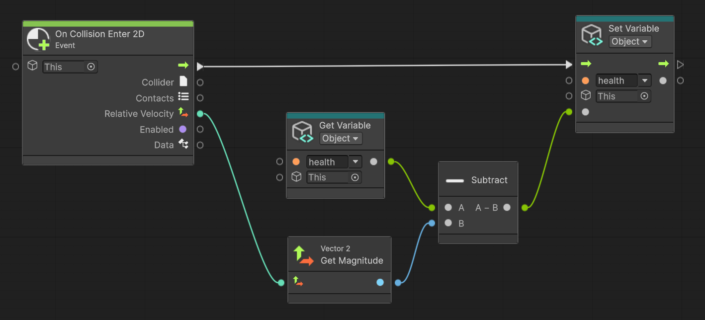

### On Collision Exit 2D ##
This event occurs once after two colliders stop colliding (in that they stop touching). It can be triggered again with the same object if the objects collide again and stop touching.

Inputs: 
Target (GameObject): If a GameObject is passed into this, the node will only execute when a collision with the specified GameObject is detected.

Outputs: 
- Trigger (Flow): The next node to execute.
- Collider (Collider 2D): The collider component of the colliding object.
- Contacts (Contact Point 2D Array): An array of [ContactPoint2D](https://docs.unity3d.com/6000.3/Documentation/ScriptReference/ContactPoint2D.html)s. These objects contain quite a bit of information, but most notably, they can tell you exactly where the collision occurred in world coordinates.
- Relative Velocity (Vector 2): The velocity of the collision. You can treat it like the force and direction of the collision.
- Enabled (Boolean): Whether a collision response is enabled or not.
- Data (Collision 2D): Contains the same information as listed above. Appears to be a holdover from regular scripting.

Usage Example:
- In this example, we’re making a fragile platform that falls after the player steps on and off it once. The platform is initially using a kinematic rigidbody, and is set to dynamic after the collision exit event.

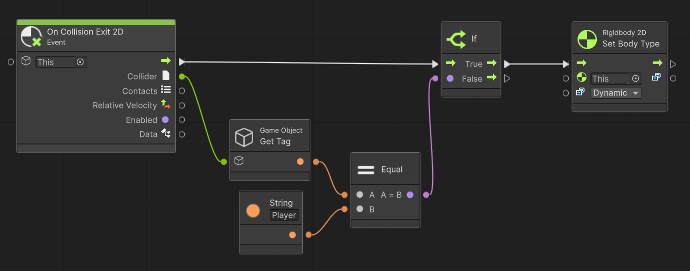

### On Collision Stay 2D ##
This event occurs every physics timestep (by default, 50 times per second) while two colliders are touching.

Inputs: 
Target (GameObject): If a GameObject is passed into this, the node will only execute when a collision with the specified GameObject is detected.

Outputs: 
- Trigger (Flow): The next node to execute.
- Collider (Collider 2D): The collider component of the colliding object.
- Contacts (Contact Point 2D Array): An array of [ContactPoint2D](https://docs.unity3d.com/6000.3/Documentation/ScriptReference/ContactPoint2D.html)s. These objects contain quite a bit of information, but most notably, they can tell you exactly where the collision occurred in world coordinates.
- Relative Velocity (Vector 2): The velocity of the collision. You can treat it like the force and direction of the collision.
- Enabled (Boolean): Whether a collision response is enabled or not.
- Data (Collision 2D): Contains the same information as listed above. Appears to be a holdover from regular scripting.

Usage Example:
- In this example we use this event to determine if a player object is touching the ground.

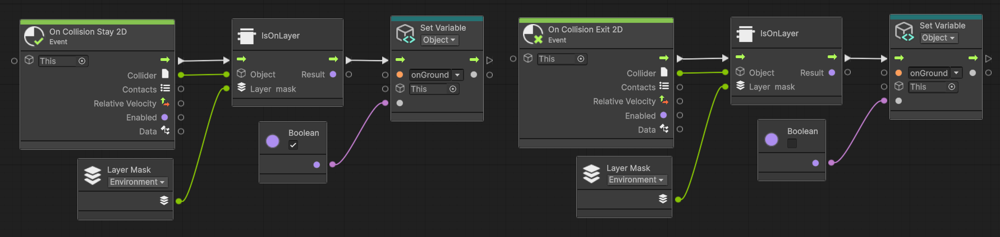

---
## Variable Nodes
Variables are a way to store/contain information in a script. They are a fundamental part of your scripts (and all of programming in general). Each variable has a type and a value. The type specifies the kind of data it can contain and the value is the data it does contain. There are also a number of scopes for you to use with your scripts. These determine where a variable can be accessed from.

Variables can be created and managed via the blackboard in the Script Graph window.

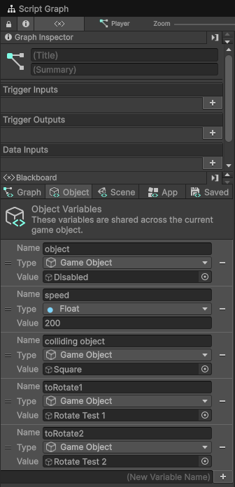

Common Types:
- Float: A number with decimal places. Can be positive or negative.
- Integer: A whole number. Can be positive or negative.
- String: Text data.
- Vector 2: A pair of floats. Intended to represent x and y values (for movement or positions).
- Game Object: Any GameObject.

Scopes: 
- Flow: Variables created within a graph. They cannot be created through the blackboard and only exist within the logical flow where they were created. To give an example, if you created a flow variable in the - - - On Update event, it would only be accessible in that On Update event after it was created. You likely won’t need to use these.
- Graph: Variables are only accessible within the graph they are associated with. They cannot be accessed by other graphs on the same object.
- Object: Variables are only accessible within the GameObject. If an object has multiple graphs, they will all be able to access these variables.
- Scene: Variables are accessible by all graphs within the same scene.
- App: Variables accessible throughout the entire game.
- Saved: These variables are also accessible throughout the entire scene. They persist, even after the game is closed. This can be used to create a basic save system.

Read more about variables [here](https://docs.unity3d.com/Packages/com.unity.visualscripting@1.9/manual/vs-variables.html).

### Get Variable ##
This node is used to read the value of a variable.

Node Settings:
- Fallback: Whether to use a fallback. A fallback is a default value for the node to produce in case the variable is not defined.
- Kind: The variable scope to use. If you are struggling to access a variable make sure to check if you are looking at the correct scope.

Inputs: 
- Name (String): The name of the variable to access.

Outputs: 
- Value (Object): The value of the variable being accessed. This is only accessible for object variables.

Usage Example:
- In this example, we’re using Get Variable to access the score from a score manager object. A reference to this score manager object is stored as a variable, which can be used to access its score variable.

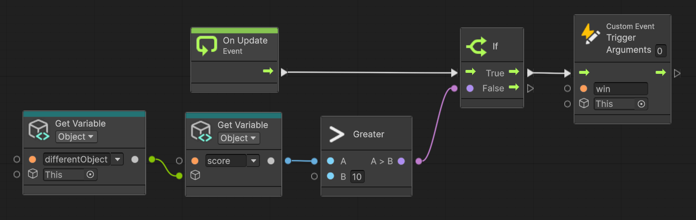

### Set Variable ##
This node is used to change the value of a variable. At the top, there is a dropdown menu that allows you to select the scope you would like to get the variable from.

Inputs: 
- Assign (Flow): The node to execute before this one.
- Name (String): The name of the variable to access.
- New Value (Object): The value to change the variable to. Make sure the value is the correct type.

Outputs: 
- Assigned (Flow): The next node to execute.
- Value (Object): The value of the variable after setting it. This is only accessible for object variables.

Usage Example:
- In this example, we’ll implement a sprinting system, where the player’s speed increases while they hold the sprint button.

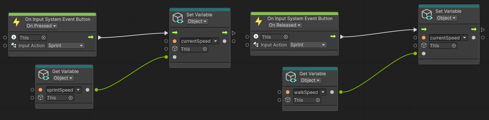

---
## Control Nodes
These nodes allow you to change the control flow of your scripts, allowing them to branch off and converge to do different things based on various conditions. Without them, your scripts would probably be a lot less responsive.

Read more about control nodes [here](https://docs.unity3d.com/Packages/com.unity.visualscripting@1.9/manual/vs-control.html).

### If ##
This node allows you to change the control flow based on a condition. Basically, that means you can create branching paths in your scripts. You can generally read an if statement as: “If the given condition is true, do something, otherwise, do something else.”

You do not necessarily need to assign both output pipes to any other nodes. If you don’t, the control flow will end if the script tries to go down the unassigned true/false path.

Inputs: 
- Enter (Flow): The node to execute before this one.
- Condition (Boolean): The condition used to choose between the two paths.

Outputs: 
- True (Flow): The next node to execute if the condition is true.
- False (Flow): The next node to execute if the condition is false.

Usage Example:
- In this example, we’ll implement a sort of “enmity” system, where the player avatar deals double damage when their HP is below half.

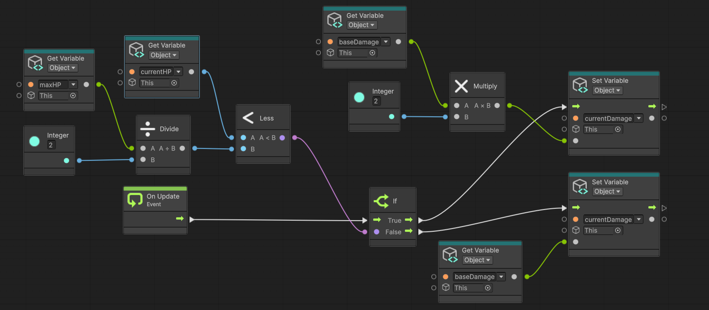

### Select ##
This node outputs one of two values based on a condition. If the condition is true, it will output the first value passed in, if it’s false, it will output the other.

Both value inputs must be assigned some value, otherwise, this node will not work.

Inputs: 
- Condition (Boolean): The condition used to choose the output.
- True (Object): The value to output if the condition is true.
- False (Object): The value to output if the condition is false.

Outputs: 
- Selection (Object): The value to output.

Usage Example:
- In this example, we’re spawning enemies based on the difficulty of the game. There are two enemy variants, and we’re going to choose to spawn one of them based on whether the game’s in hard mode or not.

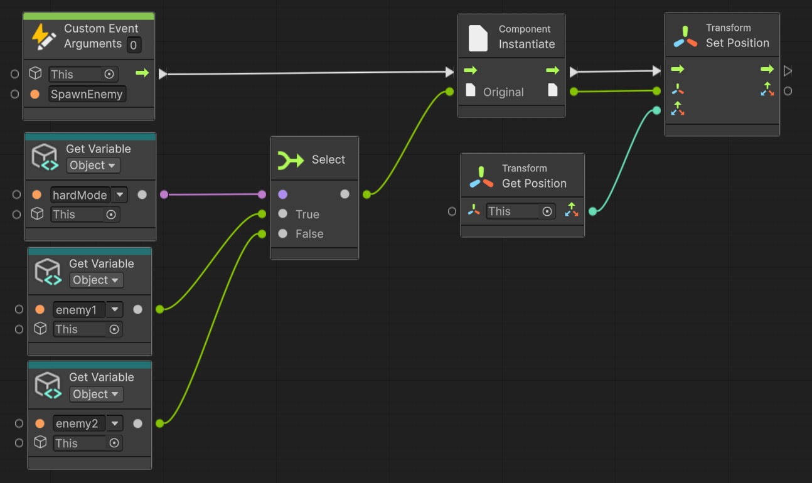

### For Loop ##
This node allows you to repeat a certain section of your graph a specified number of times. Anything attached to the body output will be repeated.

The way it works is that you provide it with a first value, last value and step value. It also separately keeps track of an index value (this can be accessed from the index output). The loop will then execute these steps:
1. Set the index value equal to the first value.
2. Check if the index is less than the last value.\
   a. If it is less, continue to step 3.\
   b. If it is greater than or equal to, the loop ends and the script executes the exit output.
3. The body output is executed once.
4. Add the step value to the index.
5. Repeat from step 2.

Inputs: 
- Enter (Flow): The node to execute before this one.
- First (Integer): The starting value for the index.
- Last (Integer): The ending value for the index.
- Step (Integer): The amount to add to the index in each loop iteration.

Outputs: 
- Exit (Flow): The node to execute after the loop completes.
- Body (Flow): The node to execute each time the loop repeats.
- Index (Integer): The current index of the loop.

Usage Example:
- In this example, we need to spawn 10 enemies at once. We could chain 10 instantiate nodes together, but in this case, a for loop would be far more appropriate.

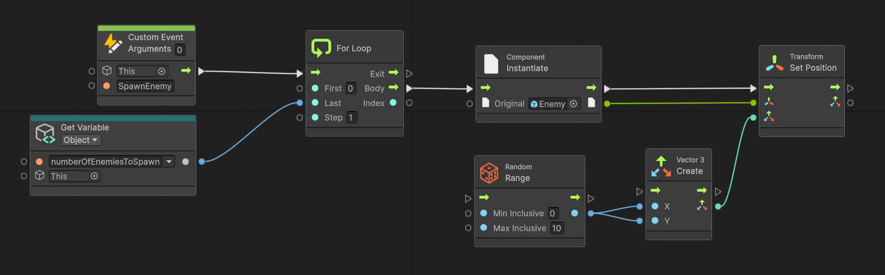

---

## Object Nodes
All objects that exist within a scene are Game Objects. This means these nodes are usable and applicable across all scene objects.

Read more about Game Objects [here](https://docs.unity3d.com/6000.3/Documentation/Manual/class-GameObject.html).

### Set Active ##
This node allows you to enable/disable a GameObject. A disabled GameObject still exists, but cannot be interacted with (i.e. rendering, colliding, performing calculations, etc.) until it is enabled again. An enabled GameObject functions as normal. If an object is a parent, its children will become active/inactive along with it.

Inputs: 
- Invoke (Flow): The node to execute before this one.
- Target (Game Object): The object to enable/disable.
- Value (Boolean): Whether to enable or disable the target. True = enable and false = disable.

Outputs: 
- Exit (Flow): The next node to execute.

Usage Example:
- In this example, our script is on a button that opens a door when pressed. To make that happen, we first detect a collision using OnTriggerEnter, then disable the door.

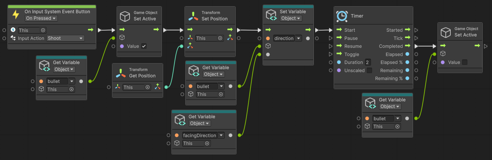

### Destroy ##
This node can be used to completely remove a GameObject from the current execution of the game. If the GameObject was saved into the scene (i.e. not instantiated after the game has started), it will return after the current execution of the game ends or the scene is reloaded.

This node has a variant that can be used to destroy a single component instead of a whole object. In this unit, you likely won’t need to use this, but it’s most useful when you need to construct and modify custom GameObjects during runtime.

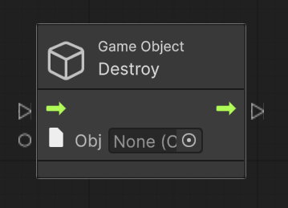

Inputs: 
- Invoke (Flow): The node to execute before this one.
- Obj (Object): The GameObject to destroy.

Outputs: 
- Exit (Flow): The next node to execute.

Usage Example:
- In this example, we’re making projectiles that destroy themselves on contact with enemies and terrain.

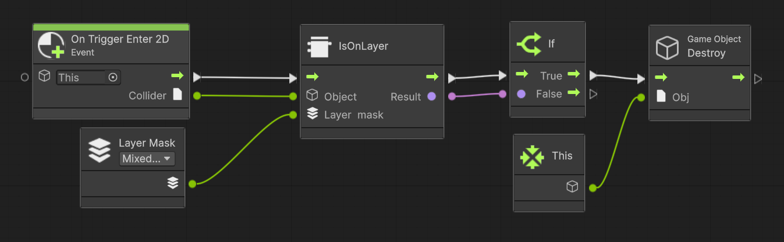

### Instantiate ##
This node is used to create instances of a prefab while the game is running. It is a very versatile node, commonly used for things like spawning enemies or pickups.

Note that there are lots of variants of this node, but the main one we’ll be using is the “Game Object: Instantiate (Original)” variant.

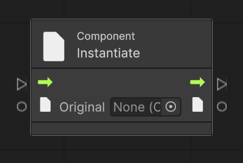

Inputs: 
- Invoke (Flow): The node to execute before this one.
- Original (Unity Object): The prefab to instantiate.

Outputs: 
- Exit (Flow): The next node to execute.
- Result (Unity Object): A reference to the instantiated object. This reference can be stored or used to modify the object.

Usage Example:
- This is an example of a simple enemy spawner. It creates an inactive enemy, sets its spawn position and activates it.

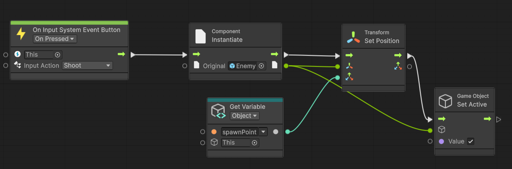

### Find ##
Finds an object based on its name in the hierarchy. If there are multiple objects with the same name, it will find one of them, but the behaviour can be inconsistent. Generally try to avoid overusing this node if possible, as it can create very fragile dependencies.

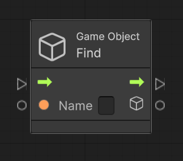

Inputs: 
- Invoke (Flow): The node to execute before this one.
- Name (String): The name of the object to find.

Outputs: 
- Exit (Flow): The next node to execute.
- Result (Game Object): The found object.

Usage Example:
- In this example, we’re creating a starting script for an enemy. As soon as it spawns, it finds and stores a reference to the player to use as a target.

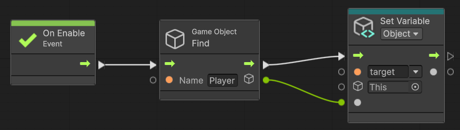

### Find With Tag ##
Finds an object with the specified tag. If there are multiple objects with the same tag, it will find one of them, but the behaviour can be inconsistent. Generally try to avoid overusing this node if possible, as it can create very fragile dependencies.

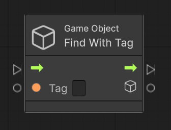

Inputs: 
- Invoke (Flow): The node to execute before this one.
- Tag (String): The name of the object to find.

Outputs: 
- Exit (Flow): The next node to execute.
- Result (Game Object): The found object.

Usage Example:
- In this example, we’re creating a starting script for an enemy. As soon as it spawns, it finds and stores a reference to the player to use as a target.

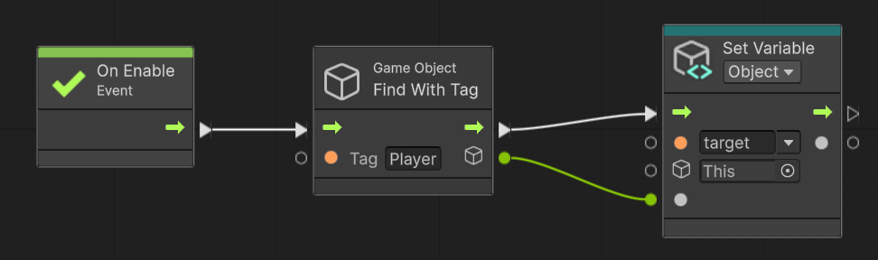

---

## Input Nodes
These allow you to read player inputs from various devices, like controllers or keyboards. If you want to use any of these nodes in a script, the object the script is attached to must also have a Player Input component and a correctly configured Input Actions asset. More information [here](https://docs.unity3d.com/Packages/com.unity.inputsystem@1.19/manual/PlayerInput.html). 

### On Input System Event Button ##
This node simply triggers the connected node when an input action is performed. Input actions are created and mapped to a key/button via the Input Actions asset.

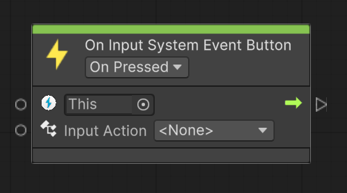

Node Settings:
- Input Action Change: Controls the type of input that triggers this node (press, hold or release). Note that hold triggers triggers once per frame while the input action is held, while press and release only trigger once.

Inputs: 
- Target (Player Input): A reference to the Player Input component. This connects it to an Input Actions asset.
- Input Action (Input Action): The action that triggers the node (i.e. shooting, jumping, walking, etc.).

Outputs: 
- Trigger (Flow): The next node to execute.

Usage Example:
- In this example, we’re using this node to create a shooting system. Whenever the shoot button is pressed, a bullet is spawned and appropriately positioned.

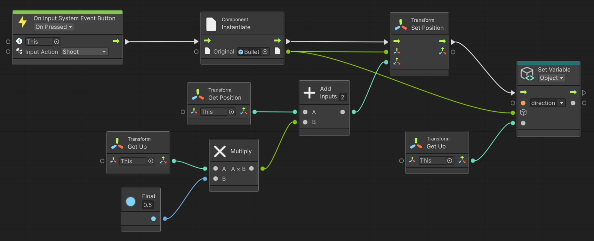

### On Input System Event Float ##
Like the On Input System Event Button node, this node also triggers whenever an input action is performed. It also outputs a numerical value based on the input action bindings. This is most commonly used with a 1D binding, where positive and negative inputs are defined. A positive input will output 1 and a negative input will output -1.

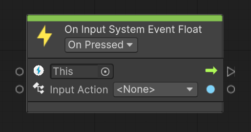

Node Settings:
- Input Action Change: Controls the type of input that triggers this node (press, hold or release). Note that hold triggers triggers once per frame while the input action is held, while press and release only trigger once.

Inputs: 
- Target (Player Input): A reference to the Player Input component. This connects it to an Input Actions asset.
- Input Action (Input Action): The action that triggers the node (i.e. shooting, jumping, walking, etc.).

Outputs: 
- Trigger (Flow): The next node to execute.
- Float Value (Float): The value of the input action.

Usage Example:
- In this example, we’re implementing standard 4-directional movement using a pair of 1D axis input bindings for horizontal and vertical movement.

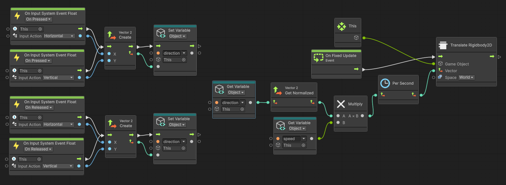

### On Input System Event Vector 2 ##
This node is used for reading 2D axes, like mouse coordinates or joystick positions and outputs a vector 2. x and y coordinates are stored in the vector 2’s x and y fields, accordingly.

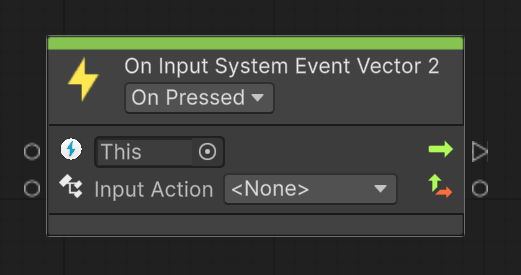

Node Settings:
- Input Action Change: Controls the type of input that triggers this node (press, hold or release). Note that hold triggers triggers once per frame while the input action is held, while press and release only trigger once.

Inputs: 
- Target (Player Input): A reference to the Player Input component. This connects it to an Input Actions asset.
- Input Action (Input Action): The action that triggers the node (i.e. shooting, jumping, walking, etc.). It must be an action with two axes.

Outputs: 
- Trigger (Flow): The next node to execute.
- Vector 2 Value (Vector 2): The value of the input action.

Usage Example:
- In this example, we’re implementing standard 4-directional movement with a controller d-pad using a single 2D axis input binding.

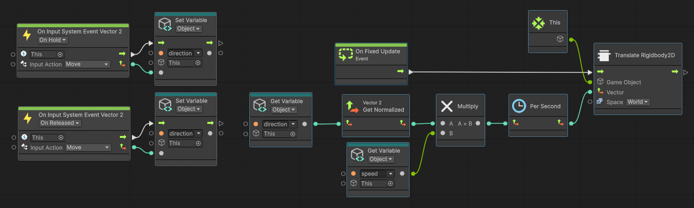

---
## Formula Nodes
These allow you to perform arithmetic within your graphs. There is a very large range of math nodes available to you, so it’s worth looking into, especially if you want to do things like custom physics.

Note that there are multiple variants of these nodes. We will generally be using the Math/Generic versions, which allows the use of any applicable data types (not just numbers). This means we can do things like concatenating strings or performing arithmetic with vectors.

Read more about formulae and arithmetic [here](https://docs.unity3d.com/Packages/com.unity.visualscripting@1.9/manual/vs-formula.html).

### Add ##
Allows you to add values together. Note that this node allows you to control the number of inputs to add together (up to 10) using the input field near the top of the node. None of the other Math/Generic nodes let you do this.

Inputs: 
- A (Object): The first value to add.
- B (Object): The second value to add.
- ...
- J (Object): The tenth value to add.

Outputs: 
- Sum (Object): The result of the addition.

Usage Example:
- This is a simple example of adding to a variable. In this case, we’re healing the player.

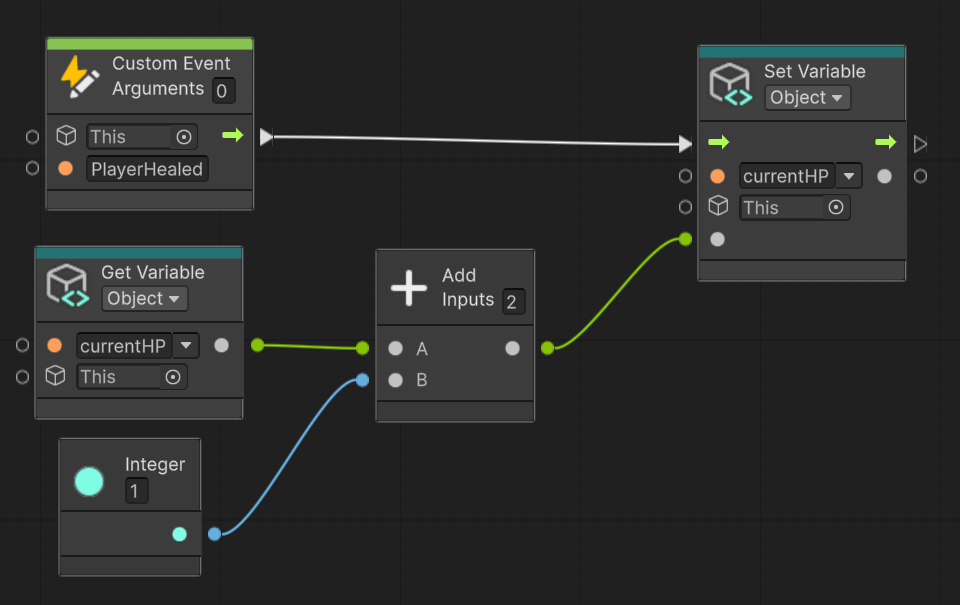

### Subtract ##
Allows you to subtract one value from another.

Inputs: 
- A (Object): The value to subtract from.
- B (Object): The value to subtract.

Outputs: 
- A - B (Object): The result of the subtraction.

Usage Example:
- A common usage of subtraction is to create a vector between two points. This is a standard example of how to move one object towards another.

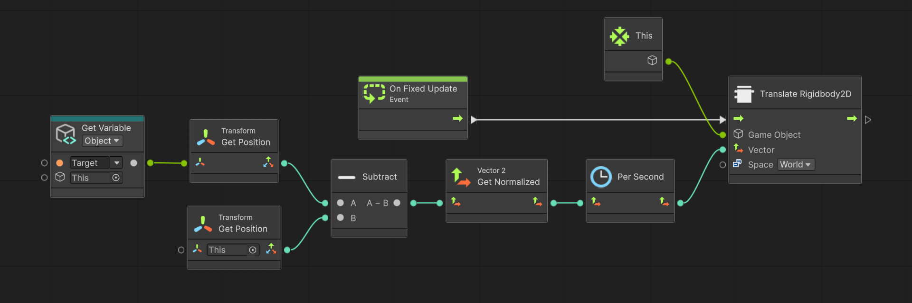

### Multiply ##
Allows you to multiply two values.

Inputs: 
- A (Object): The first value to multiply.
- B (Object): The second value to multiply.

Outputs: 
- A x B (Object): The result of the multiplication.

Usage Example:
- Some of the most common uses of multiplication would be scaling things by time or modifying vectors. This example shows that.

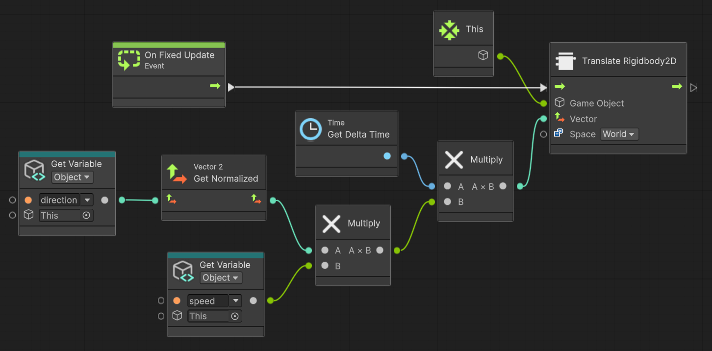

### Divide ##
Allows you to divide one value by another.

Inputs: 
- A (Object): The value to divide.
- B (Object): The value to divide by.

Outputs: 
- A ÷ B (Object): The result of the division.

Usage Example:
- When performing damage calculations, you may end up with very large numbers and need to scale them.

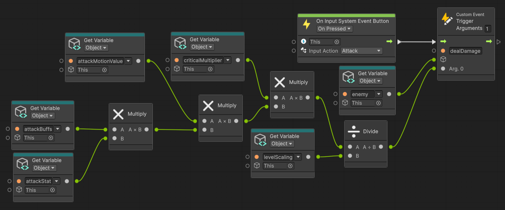

### Modulo ##
Allows you to perform modulo arithmetic. It divides the first term by the second and outputs the remainder. It’s useful for looping counters or screen wrapping.

Inputs: 
- A (Object): The value to divide.
- B (Object): The value to divide by.

Outputs: 
- A % B (Object): The remainder after dividing.

Usage Example:
- Modulo tends to be a bit rarer than the other arithmetic operators, but it’s very helpful when it does show up. In this example, we’re creating a cycling sequence of numbers (e.g. 0, 1, 2, 0, 1 ,2, 0, 1, 2, etc.). It counts up to a certain value, then resets to 0. The same could be achieved with an if statement, but using modulo makes it a lot easier. This is then being used to select a colour to set the object to.

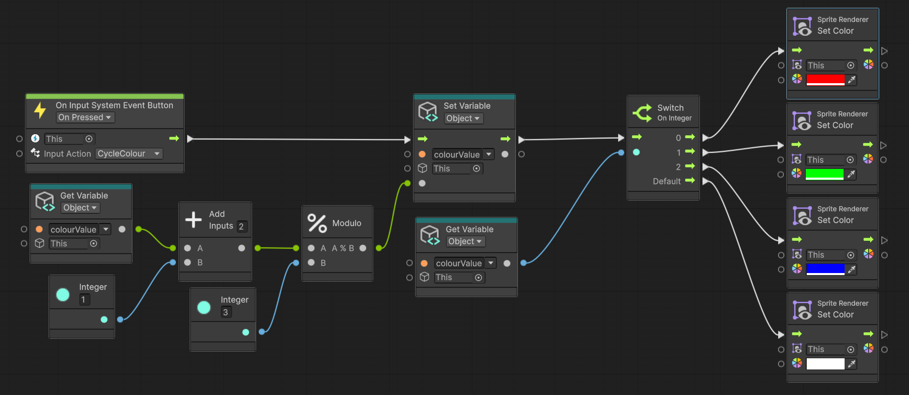

### Formula ##
This node allows you to write your own mathematical formula via text input. It can cover a lot of the same functionality as the other formula nodes. This could potentially be used if a formula is complex or difficult to wire up via individual nodes. Though, be aware that this node is not quite as performant as using your own nodes individually.

Please refer to [this document](https://docs.unity3d.com/Packages/com.unity.visualscripting@1.9/manual/vs-formula.html) for more information regarding possible inputs, operators and functions the node can recognise.

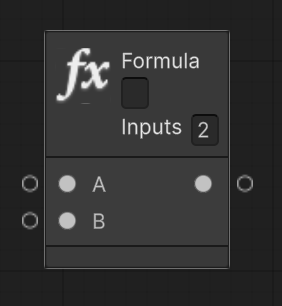

Node Settings:
- Formula: The formula to calculate. Variables will correspond to each input letter (i.e. a is input A, b is input B, etc.).
- Inputs: The number of inputs to use in the formula. There is a maximum of 10 inputs.

Inputs:
- A (Object): The first value to input.
- B (Object): The second value to input.
- …
- J (Object): The tenth value to input.

Outputs:
- Result (Object): The result of the formula.

Usage Example:
- These are implementations of the Pythagorean Theorem, with one constructed out of individual nodes and the other using the Formula node.

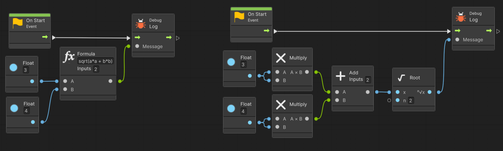

---
## Transform
This component is responsible for the position, rotation and scale of your GameObjects. All GameObjects should have one automatically if they exist within a scene. It has quite a few nodes and functions for manipulating these three aspects of your objects.

Read more about the transform component [here](https://docs.unity3d.com/6000.3/Documentation/Manual/class-Transform.html).

### Get Position ##
Gets the specified object’s position in world space.

Inputs: 
- Target (Transform): The object to get the position from.

Outputs: 
- Value (Vector3): The position of the object in world space.

Usage Example: 
- In this example, we’re using Get Position to check if the player avatar is above a certain y-coordinate. This could be used for things like determining where a player is located in a level and loading things ahead of them.

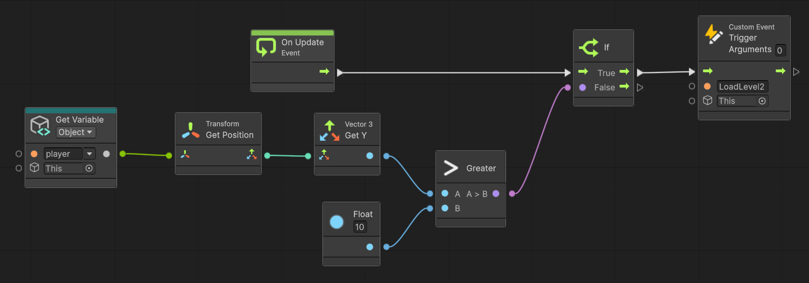

### Get Rotation ##
Gets the specified object’s rotation in world space as a quaternion. A quaternion is basically just a representation of rotation.

You can convert a Euler angle to a quaternion through the Quaternion: Euler node.

Read more about quaternions and Euler angles [here](https://docs.unity3d.com/6000.3/Documentation/Manual/QuaternionAndEulerRotationsInUnity.html).

Inputs: 
- Target (Transform): The object to get the rotation from.

Outputs: 
- Value (Quaternion): The rotation of the object in world space.

Usage Example: 
- In this example we’re going to make an entity that gets sick and turns green when it gets flipped upside-down.

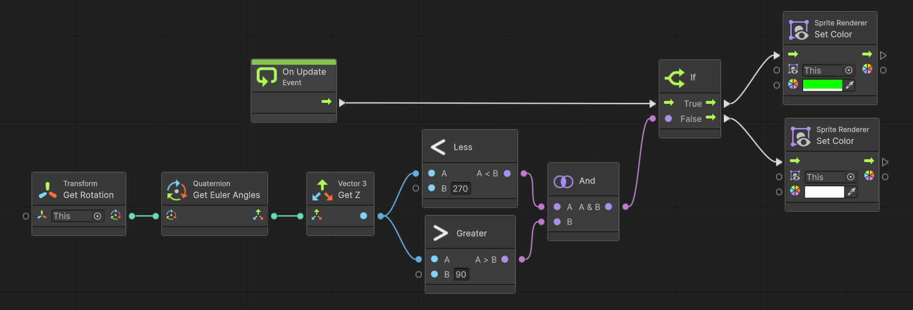

### Get Local Scale ##
Gets the specified object’s scale relative to its parent. You may wonder why we don’t have a Get Scale node. It’s complicated, but the basic idea is that scale can be affected by rotation, so it cannot be properly represented as a Vector3. You can use the Transform: Get Lossy Scale node if you would like an approximation of scale in world space.

Inputs: 
- Target (Transform): The object to get the scale from.

Outputs: 
- Value (Vector3): The scale of the object relative to its parent.

Usage Example: 
- In this example, we have a power-up that makes the player avatar larger. We don’t want it to grow uncontrollably, so we’ll also use this node to cap it.

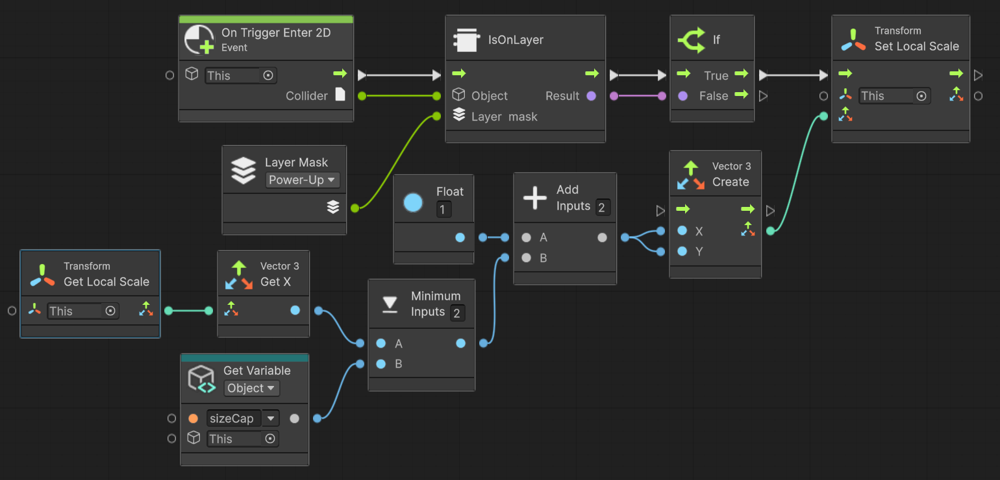

### Set Position ##
Sets the specified object’s position in world space. This effectively teleports the object to the given position, disregarding any collisions.

Inputs: 
- Set (Flow): The node to execute before this one.
- Target (Transform): The object to set the position of.
- Value (Vector 3): The position to set the object to.

Outputs: 
- On Set (Flow): The next node to execute.
- Value (Vector 3): The position that the object was set to.

Usage Example: 
- This is a simple script for a teleporter. Anything that touches the collider of the object this script is attached to is teleported to a specified position.

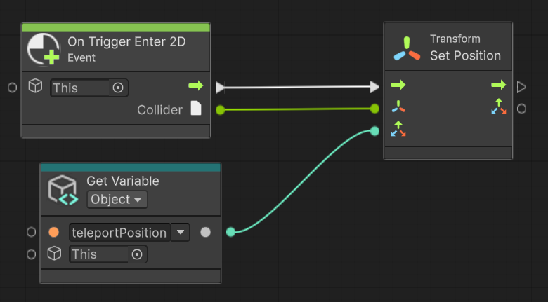

### Set Local Scale ##
Sets the specified object’s scale, relative to its parent. There is no Set Scale function, but this node should cover all of your needs.

Inputs: 
- Set (Flow): The node to execute before this one.
- Target (Transform): The object to scale.
- Value (Vector 3): The scale to set the object to, relative to its parent.

Outputs: 
- On Set (Flow): The next node to execute.
- Value (Vector 3): The scale that the object was set to, relative to its parent.

Usage Example: 
- In this example, we’re implementing the functionality of a growth potion. When the player collects it, they grow to double their size for 5 seconds, then they shrink back to their original size. Note that you will have to track their original size if you use scale values other than (1,1).

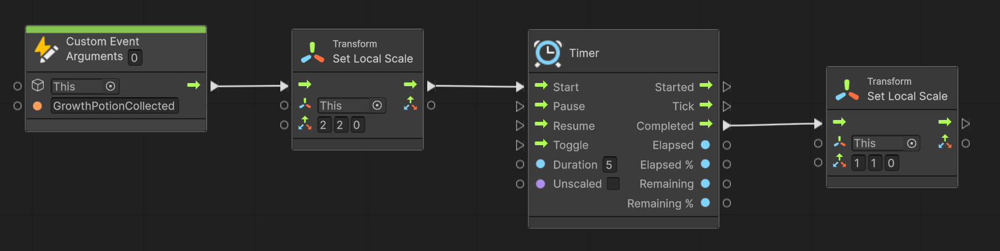

---
## Time
The time class allows you to interact with many different aspects of time within your games, like seeing how long your levels have been loaded for or checking framerate information. We won’t be using too much of that outside of delta time, but it’s worth being aware of its existence.

### Get Delta Time
Allows you to check the time interval between frames. Frame rate can be variable (as you may have experienced if you have a not-so-up-to-date PC and are trying to play an intensive game), so making things dependent on it can lead to unexpected behaviours at different frame rates, like the same characters/objects moving at different speeds or certain inputs and actions becoming impossible. Applying delta time to any frame rate-based actions (e.g. translating an object in the update event) will instead make them time-based and thus remove any frame rate discrepancies.

Inputs: 
- None

Outputs: 
- Value (Float): Seconds since last frame.

Usage Examples:
- This script rotates an object 360 degrees per second, meaning it performs a full rotation every second. The Per Second node makes this very easy to do. To highlight how they differ, this example works identically to the Per Second example.

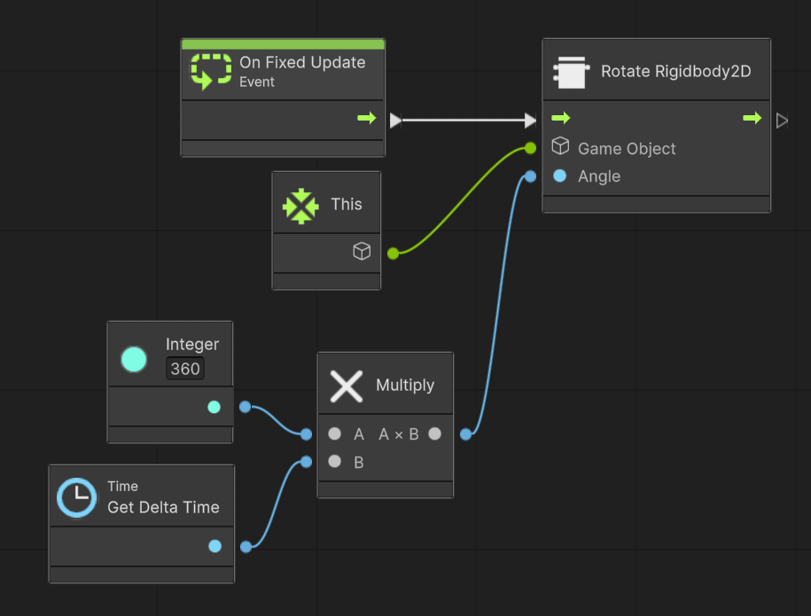

### Per Second ##
Scales a floating point value by Delta Time. Effectively, this converts a per-frame value into a per-second value. This is most easily communicated with an example:

If you used the Translate node to move an object left by 1 unit, then executed it in the Update event, it would move left by 1 unit every frame. At 60 fps, it would move 60 units per second (by most metrics, too fast). If you passed that 1 unit through the Per Second node before translating, it would automatically scale the value so that the object would move left by 1 unit per second, instead of 1 unit per frame.

Using this ensures consistent behaviour, regardless of framerate. It is generally very important to implement.

There are also variants for vectors, which function identically, but apply to vectors instead. Very useful for movement and similar applications.

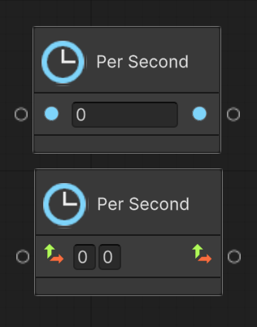

Inputs:
- Input (Float): The value to convert.

Outputs:
- Output (Float): The converted value.

Usage Examples:
- This script rotates an object 360 degrees per second, meaning it performs a full rotation every second. The Per Second node makes this very easy to do. To highlight how they differ, this example works identically to the Get Delta Time example.

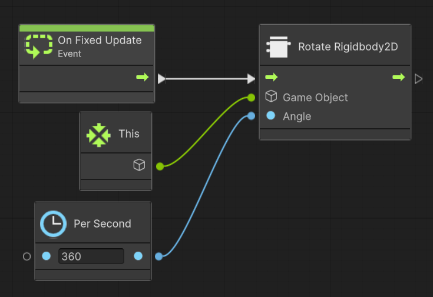

---
## Vector2

A Vector 2 is a representation of a 2D direction or a point. It’s basically just a pair of numbers, representing an x and y value. Be sure to distinguish between vectors and coordinates, as Vector 2s are used to represent both. Vectors represent directions, while coordinates represent positions.

### Get Magnitude ##
Gets the magnitude of a Vector 2. The magnitude is the length of the vector, represented as a singular number.

Inputs: 
- Target (Vector 2): The vector to measure.

Outputs: 
- Value (Float): The magnitude of the vector.

Usage Examples:
- If the movement vector of an object can be found, calculating its magnitude can effectively be used to measure its speed. In this example, we use this to double the speed of a moving object.

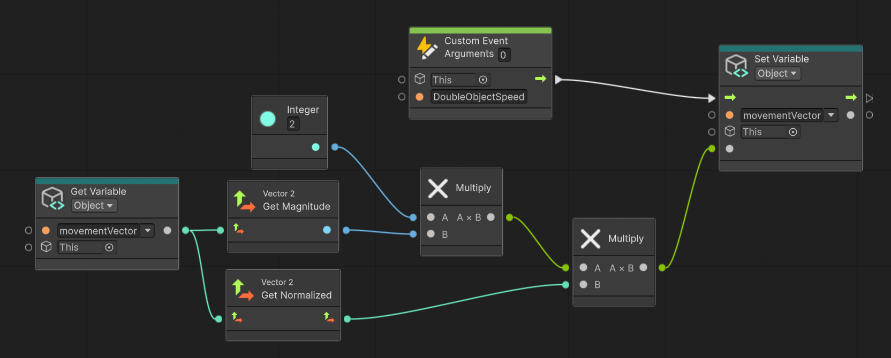

### Get Normalized ##
Sets a vector’s magnitude to 1, whilst retaining its direction. We tend to want to normalise vectors when comparing or modifying them, as it brings them all to a consistent length while retaining their direction. Imagine trying to change the magnitude of a vector from 3.21511573 to 5. It would probably be easier to normalise it and multiply it by 5 than it would be to scale that starting value.

Note that this is specifically the Vector2: Get Normalized node. There are other similarly-named nodes that do different things.

Remember to spell it with the American English spelling in Unity.

Inputs: 
- Target (Vector 2): The vector to normalise.

Outputs: 
- Value (Vector 2): The normalised vector.

Usage Example: 
- This example is a simple demonstration of movement. Normalisation is important to keep movement speed consistent (try it without normalisation and see the difference). You may have seen that in some games, moving diagonally is faster than moving in one of the cardinal directions. This is because a movement vector of (1,1) is longer than a vector of (1,0), so applying that directly to a player’s position will result in more movement. Normalising the vectors before applying them will ensure that they are always the same length.

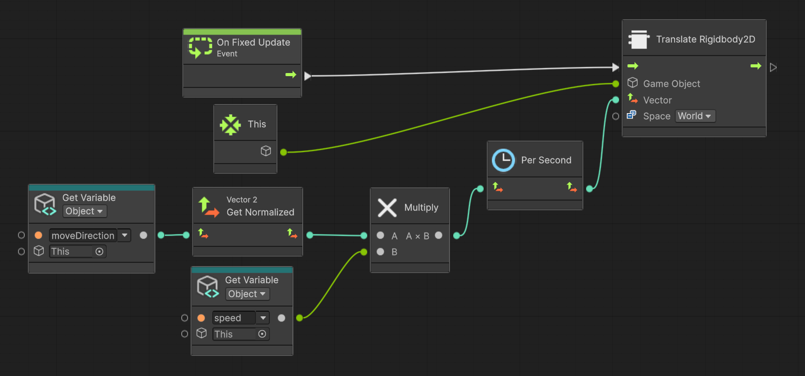

---
## Debug
This is a collection of functions and nodes to help visualise and debug your scripts in various ways. Oftentimes, large parts of your scripts may be completely opaque, making it very hard to understand what’s going on (though, this is largely alleviated by the visual nature of visual scripting). You can use these nodes to print things in the console or draw things on your screen.

### Log ##
Prints a specified object to the console. You can print anything, as long as it can be represented as text.

Inputs: 
- Invoke (Flow): The node to execute before this one.
- Message (Object): The object to print to the console.

Outputs: 
- Exit (Flow): The next node to execute.

Usage Example:
- This is a very simple example of a debugging script. While the game runs, it continually prints a variable, which can be used to view any changes that might occur with the variable over time.

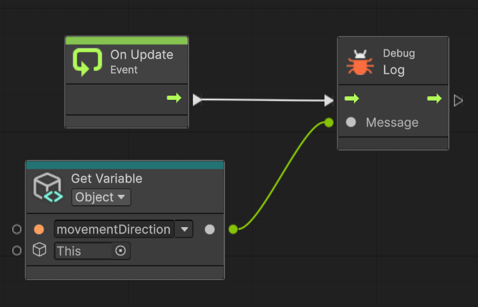

---

## Custom Nodes
These nodes are not a part of the default Unity installation. We’ve provided them to you as part of COMP1151 as additional utilities or to simplify more advanced actions. These are here to make your life easier at this early stage of your game development journey, so have a go and see what you can do with them.

### Translate Rigidbody 2D ##
Moves an object by a specified amount each time this node is executed. Note the difference between translation and setting an object’s position. Translation moves an object from its current position, while setting an object’s position effectively teleports it.

Note: A Rigidbody2D component is required on the rotating object.

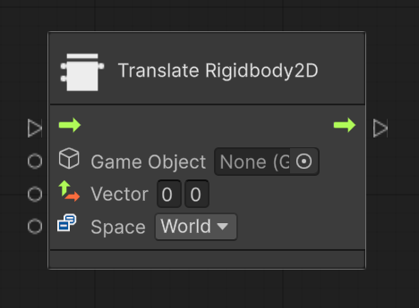

Inputs:
- Input Trigger (Flow): The node to execute before this one.
- Game Object (Game Object): The object to move (it does not have to be the same object the script is attached to).
- Vector (Vector2): The distance to move on the x and y axes.
- Space (Space): The coordinate space to move in. To grossly simplify things, it’s whether to account for the object’s rotation. When set to World, it will ignore any rotation the object has, and when set to Self, it will account for any rotation the object has.

Outputs:
- Output Trigger (Flow): The next node to execute.

Usage Example:
- This is a standard example of movement.

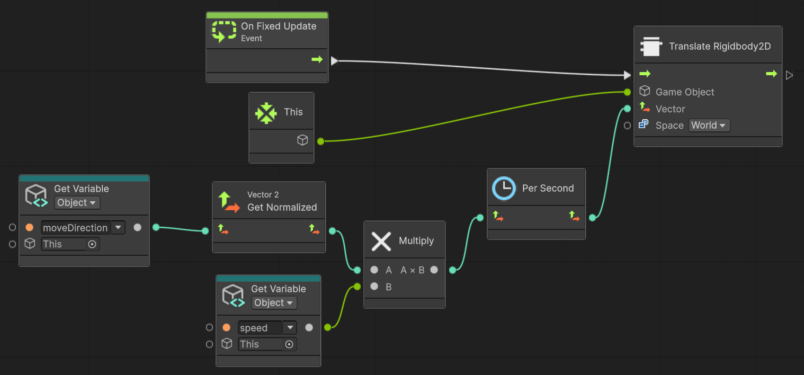

### Rotate Rigidbody 2D ##
Applies a specified rotation to a GameObject with a Rigidbody2D each time this node is executed. Note that applying a rotation and setting a rotation are distinct. Applying a rotation will add to an object’s current rotation, while setting a rotation will directly set it to a specific angle. As this variant works with rigidbodies, it will respect physical collisions, meaning its rotation will be stopped or slowed if rotation causes it to collide with something.

Note: A Rigidbody2D component is required on the rotating object.

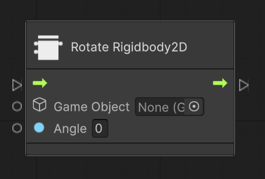

Inputs:
- Input Trigger (Flow): The node to execute before this one.
- Game Object (Game Object): The object to rotate (it does not have to be the same object the script is attached to).
- Angle (Float): The amount of rotation to apply in degrees.

Outputs:
- Output Trigger (Flow): The next node to execute.

Usage Example:
- In this example, we’re rotating the player avatar based on the player’s left/right inputs, where it rotates clockwise when they hold right and counterclockwise when they hold left. In a case like this, the player avatar will need to respond to physical collisions to prevent it from clipping into walls.

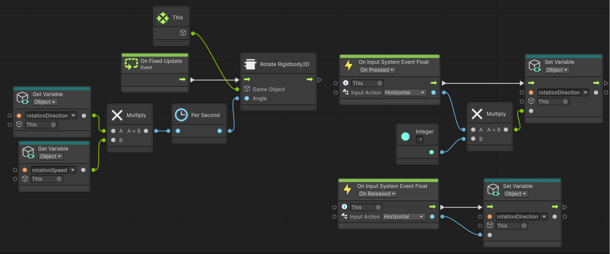

### Rotate Transform 2D ##
Applies a specified rotation to a GameObject each time this node is executed. Note that applying a rotation and setting a rotation are distinct. Applying a rotation will add to an object’s current rotation, while setting a rotation will directly set it to a specific angle. As this variant does not use the object’s Rigidbody, it does not account for physical collisions when rotating.

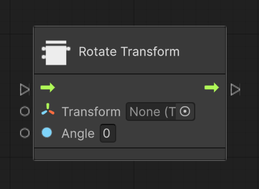

Inputs:
- Input Trigger (Flow): The node to execute before this one.
- Game Object (Game Object): The object to rotate (it does not have to be the same object the script is attached to).
- Angle (Float): The amount of rotation to apply in degrees.

Outputs:
- Output Trigger (Flow): The next node to execute.

Usage Example:
- This script continuously rotates the object it’s applied to. This is ideal for rotating objects that do not need to respond to collisions, like damaging obstacles or even stage decorations. A good example of a damaging obstacle would be the fire bars from the Mario games. They simply rotate at a constant speed at all times and cannot physically collide with anything.

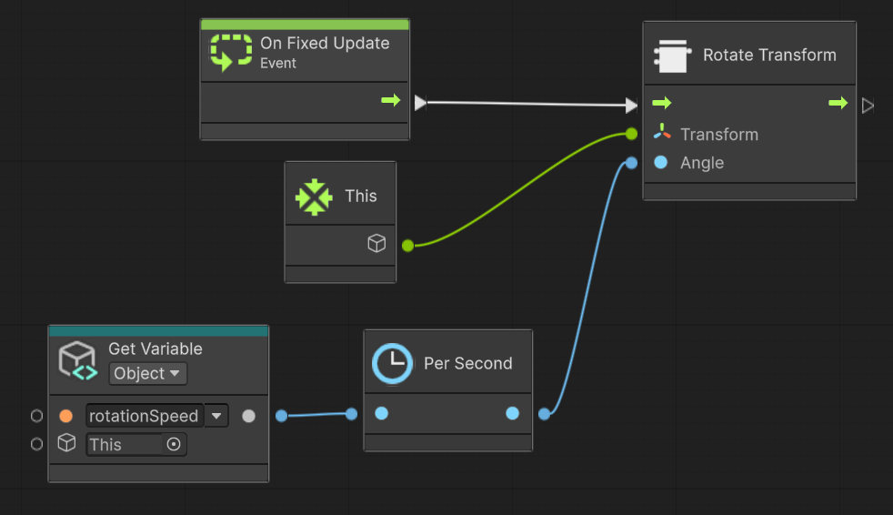

### Is On Layer ##
Checks if an object is on a specified layer.

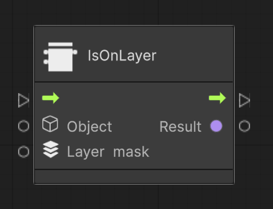

Inputs:
- Input Trigger (Flow): The node to execute before this one.
- Object (Game Object): The object to to check.
- Layer Mask (Layer Mask): The layers to check for (use a Layer Mask Literal here if you’re not sure what to use).

Outputs:
- Output Trigger (Flow): The next node to execute.
- Result (Boolean): Whether the object is on the specified layer(s) or not.

Usage Example:
- This script detects collisions with different objects and responds differently. Generally, this is not necessary with appropriate layer management, but it is an option.

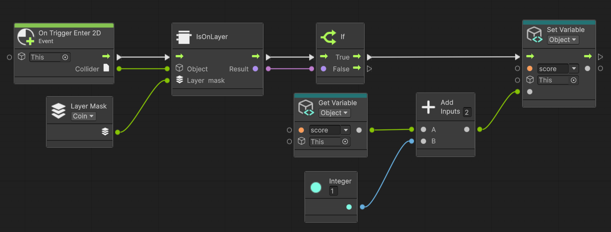